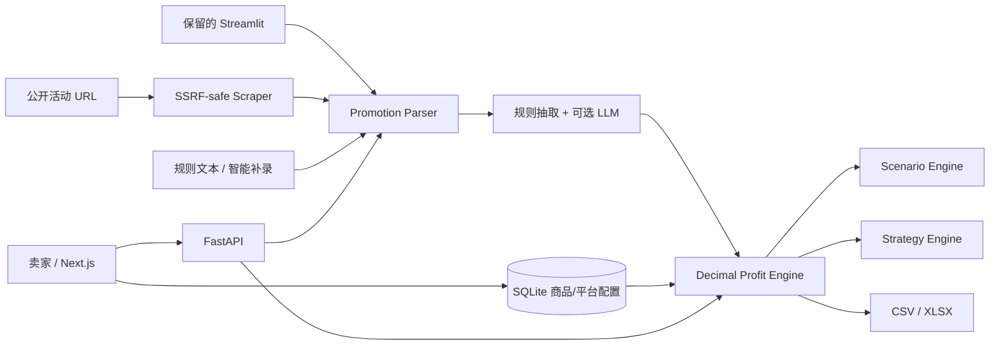

# 架构说明

## 设计原则

CrossProfit AI 采用共享领域服务的模块化单体。Next.js 比赛主界面通过 FastAPI 调用现有服务；保留的 Streamlit 与 FastAPI 共享领域 schema 和 service layer，避免 UI 与 API 出现两套计算口径。SQLite 自动初始化，网络与 LLM 均为可选依赖路径。

## 责任边界

- `schemas/domain.py`：统一活动、商品、平台配置、计算结果与拆解结构。
- `profit_engine.py`：唯一财务事实来源；不发网络请求，不调用 LLM，不依赖数据库。
- `platforms/`：演示默认值、平台活动标准化与未来特定成本扩展点。
- `scraper/`：公开页面读取、安全校验和正文清洗。任何失败都转为用户可操作的 fallback。
- `promotion_parser.py`：规则候选、归一化、置信度和缺失字段建议。
- `scenario_engine.py`：销量、退货和物流的三情景扰动。
- `strategy_engine.py`：由计算事实触发规则建议；自然语言增强不能改数字。
- `models/`：规范化核心表；活动扩展参数保留有限 JSON，不把商品/平台结构粗暴装入单 JSON。

## 数据模型

- `products` 只保存商品本体成本与物理属性。
- `product_platform_configs` 保存同一商品各平台售价与费率。
- `promotion_activities` 保存结构化公共活动字段，长尾参数进入 `parameters`。
- `analysis_results` 保存可排序核心指标与完整可复现输出。
- `scenario_results` 保存情景指标并关联分析。

## 可扩展性

新增平台时实现 `PlatformAdapter` 四个约定方法并注册；新增抓取策略不影响解析器接口；替换 LLM 只需实现 `LLMProvider`；未来可将 SQLite 切换 PostgreSQL 而保持服务层不变。
